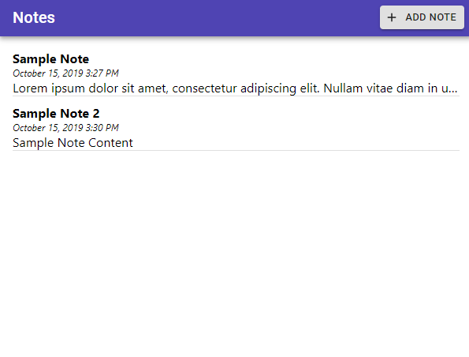

## Basic Notes App



Using:

1. React
2. GraphQL / Apollo
3. Material-UI

After running `yarn install` in both root and server directories, start start the server from root with

```
yarn server
```

And start the app with

```
yarn start
```
